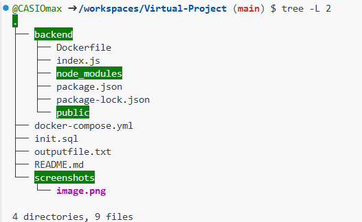
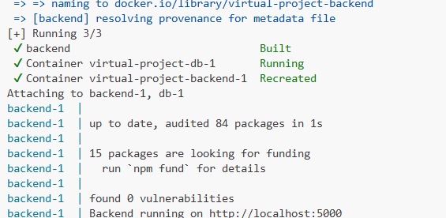
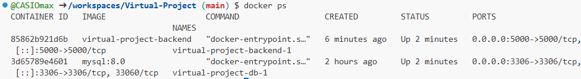
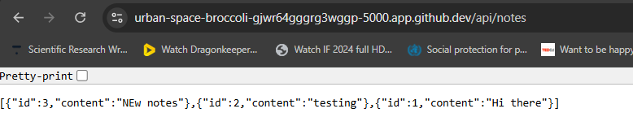
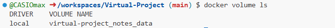

# 🐳 Notes App Project – Docker-Based Full Stack App

## 📌 Overview

This project is a **simple Notes App** developed with a static frontend (HTML/CSS/JS), a **Node.js backend**, and a **MySQL database**, all containerized using **Docker** and managed using **Docker Compose**. The primary objective of this project was to understand and demonstrate **multi-container orchestration**, **Docker image creation**, **service separation**, and **persistent storage using volumes**.

---

## 🧱 Project Structure

```bash
project-root/
├── backend/
│   ├── Dockerfile           # Builds the Node.js backend image
│   ├── index.js             # Backend server with notes API
│   ├── package.json         # Node dependencies
│   └── public/
│       └── index.html       # Frontend UI served by backend
├── docker-compose.yml       # Orchestrates backend & DB
└── README.md                # Project documentation
````

📸 **Screenshot:**


---

## ⚙️ Technologies Used

* **Node.js** – JavaScript runtime for backend
* **MySQL 8.0** – Relational database
* **Docker** – Containerization of services
* **Docker Compose** – Managing multi-container environments
* **HTML, CSS, JS** – Frontend UI
* **cURL/Postman** – For testing API endpoints

---

## 🐳 Docker Architecture Overview

```plaintext
+--------------------+
| Frontend (HTML/JS) |
+--------------------+
         |
         v
+--------------------------+
| Node.js API (backend)    |
| - Serves HTML frontend   |
| - Handles /api/notes     |
+--------------------------+
         |
         v
+--------------------------+
| MySQL Database           |
| - Stores notes           |
| - Connected via Docker   |
+--------------------------+
```

All services run in isolated containers, managed by Docker Compose.

---

## 🚀 Step-by-Step: How This Project Was Built and Run

### 🛠️ 1. Set Up Backend & Frontend (Node.js + HTML)

* Created `index.js` – basic Express server that:

  * Serves static `index.html`
  * Connects to MySQL
  * Provides GET/POST APIs at `/api/notes`

* Created `public/index.html` – simple HTML app that:

  * Fetches notes from `/api/notes`
  * Displays them on the page

---

### 🐳 2. Wrote Dockerfile for Backend

`backend/Dockerfile`:

```Dockerfile
FROM node:18

WORKDIR /app

COPY package*.json ./
RUN npm install

COPY . .

EXPOSE 5000
CMD ["node", "index.js"]
```

📌 This defines a custom image for the backend service.

---

### ⚙️ 3. Created `docker-compose.yml` to Orchestrate Everything

```yaml
version: '3.8'

services:
  backend:
    build: ./backend
    ports:
      - "5000:5000"
    depends_on:
      - mysql
    environment:
      DB_HOST: mysql
      DB_USER: root
      DB_PASSWORD: password
      DB_NAME: notesdb

  mysql:
    image: mysql:8
    environment:
      MYSQL_ROOT_PASSWORD: password
      MYSQL_DATABASE: notesdb
    volumes:
      - db_data:/var/lib/mysql

volumes:
  db_data:
```

📌 This defines two services:

| Service   | Image / Build         | Role                  |
| --------- | --------------------- | --------------------- |
| `backend` | Built from Dockerfile | Serves frontend + API |
| `mysql`   | Official MySQL image  | Persistent database   |

---

## 🧪 Commands Used to Run & Test Project

### 🔧 Build and Start Containers

```bash
docker-compose up --build
```

📸 **Screenshot:**


✅ This command:

* Builds the backend Docker image
* Pulls the MySQL image
* Creates a custom Docker network
* Mounts a named volume for DB persistence
* Starts both services

---

### 📂 Verify Containers Are Running

```bash
docker ps
```

📸 **Screenshot:**


You should see both containers (`backend` and `mysql`) running.

---

### 🔄 Stop Containers

```bash
docker-compose down
```

🚫 This stops and removes containers, but **does not delete the volume** (`db_data`) so your notes remain safe.

---

## 🧪 Testing the Application

### ✅ Access the App in Browser

Navigate to:
[http://localhost:5000](http://localhost:5000)

📸 **Screenshot**:


You’ll see the frontend UI loaded from `public/index.html`.

---

### 📬 API Testing with curl

#### Get All Notes

```bash
curl http://localhost:5000/api/notes
```

📸 **Screenshot:**


---

## 💾 Persistent Storage (Volumes)

The `db_data` volume in `docker-compose.yml` ensures your notes are saved to your system disk, so even if you remove containers:

```bash
docker-compose down
```

… you don’t lose your data. Restart the containers, and your notes are still there!

```bash
docker-compose up
```

To inspect volumes:

```bash
docker volume ls
```

📸 **Screenshot:**


---

## 🧹 Clean Everything

To remove containers + volume:

```bash
docker-compose down -v
```

---

## 🧠 Learning Outcomes / Key Concepts

* Containerized a backend app using Docker
* Served static frontend from Node backend
* Orchestrated backend + MySQL using Docker Compose
* Managed data persistence using Docker Volumes
* Tested APIs via cURL and browser
* Understood service dependencies and networking inside Docker

---

## 📸 Screenshots Included

| Screenshot Title               | Filename                |
| ------------------------------ | ----------------------- |
| Project Folder Structure       | `project-structure.png` |
| `docker-compose up --build`    | `docker-up.png`         |
| `docker ps` running containers | `docker-ps.png`         |
| cURL GET `/api/notes`          | `api-get-notes.png`     |
| Docker Volume Listing          | `docker-volume-ls.png`  |
| Browser UI (optional)          | `browser-ui.png`        |

---

## ✍️ Project Team

```
Sajjad Ahmad
ITS-11072

Saad Sarwar
ITS-11068

Umair Hanif
ITS-11058
```